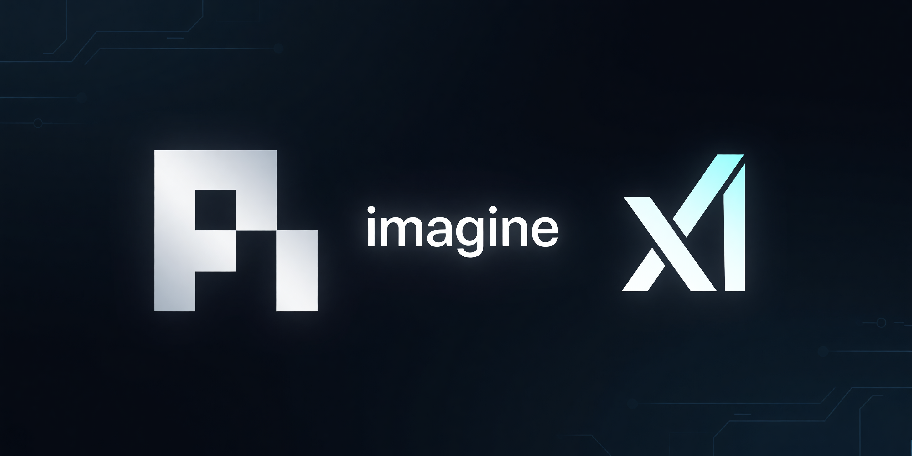

# Pi xAI Imagine

[](https://github.com/luxus/pi-xai-imagine/actions/workflows/ci.yml)



Standalone Pi extension for xAI media workflows.

## Features

- `generate_image` — create images from prompt or remix from reference images
- `edit_image` — edit one or more images with natural language
- `generate_video` — text-to-video, image-to-video, or reference-to-video
- `edit_video` — edit existing public or xAI-hosted video URL
- `extend_video` — continue existing video from last frame
- `understand_image` — analyze images with xAI vision/reasoning via `/v1/responses`
- `open_xai_studio` — open native Glimpse studio for refs, remix, edits, image-to-video, video edit/extend
- `check_xai_health` — verify xAI auth, base URL, models visibility, config source
- `/xai-studio` — command alias to open studio
- `/xai-health` — command alias to run health check

## Dev

```bash
bun install
bun run format:fix
bun run lint:fix
bun run typecheck
```

Pre-commit hook via `lefthook` runs format, lint fix, typecheck on staged files.
Typecheck uses `tsgo` (`@typescript/native-preview`).
GitHub Actions runs `bun run check:ci` on push/PR.
CI pinned to Bun `1.3.11`.

## Notes

- API key source: `XAI_API_KEY` env var or Pi settings at `./.pi/settings.json` or `~/.pi/agent/settings.json`
- Shared config namespace ready for reuse:
  ```json
  {
    "xai": {
      "apiKey": "xai-...",
      "baseUrl": "https://api.x.ai/v1",
      "imagine": {
        "autoOpenGlimpse": true
      },
      "voice": {},
      "search": {}
    }
  }
  ```
- Legacy `piXaiGen` settings still merge into `xai.imagine`
- Image output supports `url` and `b64_json`
- Video flow supports polling timeout + interval controls
- Video generation blocks invalid `image + referenceImages` combination
- Image understanding uses `store: false`

## Repo assets

- Banner: `assets/pi-xai-imagine-github-banner.png`
